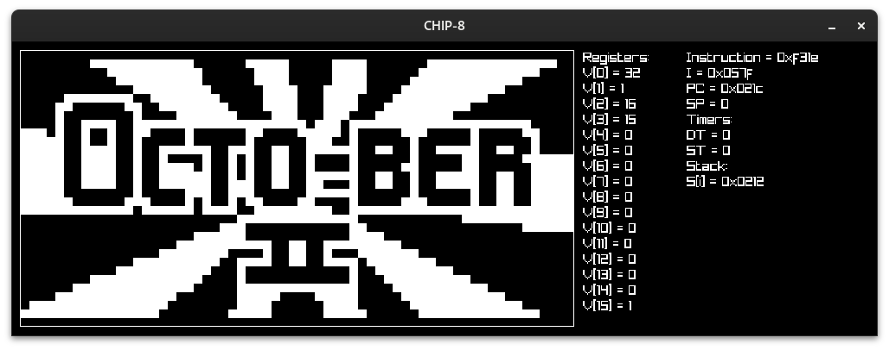

# CHIP-8-raylib

*work-in-progress*

Pretty self-explanatory, this is a chip-8 interpreter made using raylib.
Currently the interpreter is only able to run the splash screen type roms(IBM-logo, chip8-logo), as not all instructions have been implemented yet.

Resources used:
- [Guide to making a CHIP-8 emulator](https://tobiasvl.github.io/blog/write-a-chip-8-emulator/#keypad)
- [Cowgod's Chip-8 Technical Reference v1.0](http://devernay.free.fr/hacks/chip8/C8TECH10.HTM#0.1)
- [CHIP-8 test suite](https://github.com/Timendus/chip8-test-suite)
